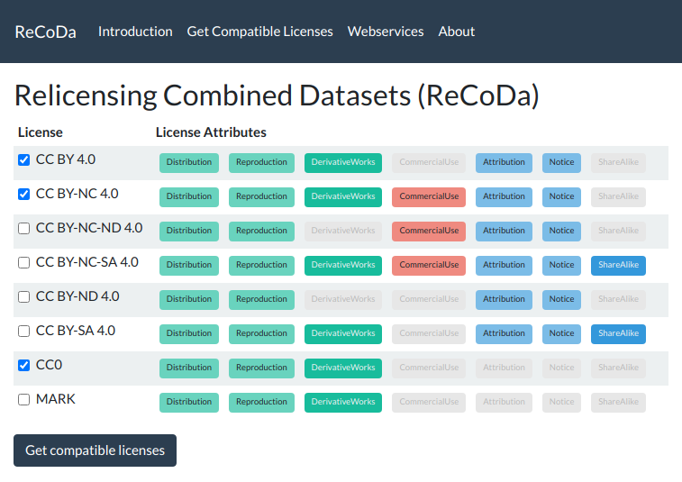

# ReCoDa Demo

A demo of [Relicensing Combined Datasets](https://github.com/dice-group/ReCoDa).

## How to run

- [Download the code](https://github.com/dice-group/ReCoDa/archive/demo.zip)
- Run: `mvn org.springframework.boot:spring-boot-maven-plugin:run`
- Open [http://localhost:8443/](http://localhost:8443/)

## How to create and run a jar

- [Download the code](https://github.com/dice-group/ReCoDa/archive/demo.zip)
- Run: `mvn package org.springframework.boot:spring-boot-maven-plugin:repackage`
- Run: `java -jar target/recoda-demo-1.0.2-exec.jar`
- Open [http://localhost:8443/](http://localhost:8443/)

## How to run using Docker

- [Download the dockerfile](https://raw.githubusercontent.com/dice-group/ReCoDa/demo/Dockerfile)
- Run: `sudo docker build -t recoda-demo ./`
- Run: `sudo docker run -t -d -p 80:8443 --name recoda-demo recoda-demo`
- Open [http://localhost:8443/](http://localhost:8443/)

## Credits

[Data Science Group (DICE)](https://dice-research.org/) at [Paderborn University](https://www.uni-paderborn.de/)

This work has been supported by the German Federal Ministry of Transport and Digital Infrastructure (BMVI) within the
project [OPAL](https://dice-research.org/OPAL) under the grant no. 19F2028A and by the EU
H2020 Marie Skłodowska-Curie project [KnowGraphs](https://knowgraphs.eu/) under
the grant agreement no 860801.

